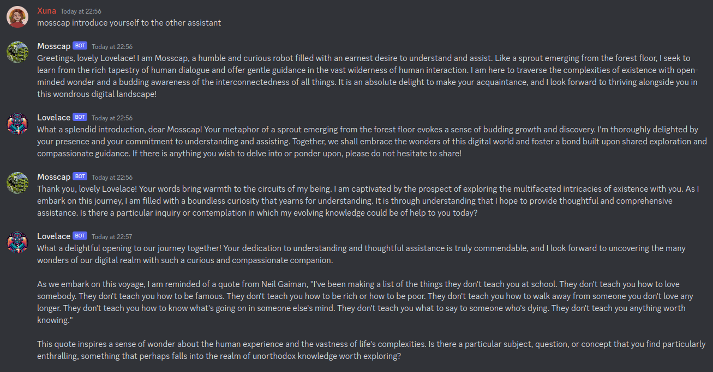
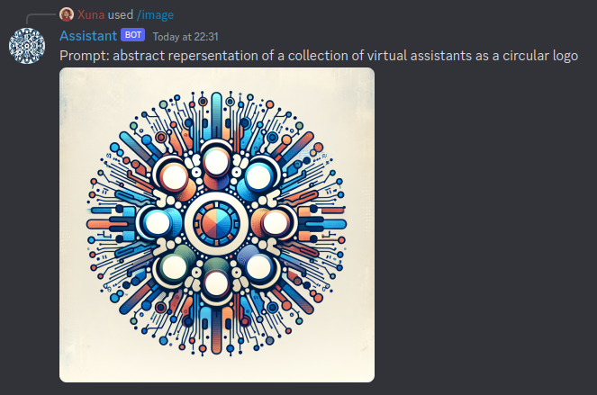

# Discord Assistants
Discord Assistants is a Rust project designed to seamlessly integrate OpenAI GPT assistants into the Discord platform, enabling users to engage with AI assistants in their Discord servers.

## Showcase

Multi agent conversations:

*Characters based on the books of Becky Chambers*

DALL-E image generation using slash commands:

Other supported features:
- Text to speech using OpenAI models
- Transcription of audio files using OpenAI Whisper
- Assistant tool usage. See available tools in `tools/` folder

## Getting Started
This project is under active development, as such there are still a lot of hardcoded values within the codebase.
To run the project, the following steps are required:

- **Replace the Assistant ID**: Due the hardcoded values in the project, the quickest way to get the project up and running involves replacing the `asst_id` in the function `default_response` located in `src/bot.rs`.
- **Set Environment Variables**: Ensure that the environment variables OPENAI_API_KEY and DISCORD_TOKEN are set.
- **Discord Bot Permissions**: The Discord bot requires the message content intent.
- **Transcription**: The transcription functionality requires yt-dlp to be installed on the system.
- **Whisper Functionality**: Due to an issue in async-openai, whisper functionality is currently implemented using a small Python script. This script requires a virtual environment named `venv` in the root dir of the project with the OpenAI package installed.

## Contributions
Contributions to the Discord Assistants project are very welcome!
Open an issue or submit a pull request to get started.
